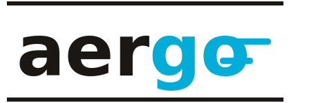

<p align="center">
  <picture>
    <source media="(prefers-color-scheme: dark)" srcset="assets/logo-dark.svg">
    <source media="(prefers-color-scheme: light)" srcset="assets/logo-light.svg">
    
  </picture>
</p>

<p align="center"><em>Zero-dependency, pure Go <a href="https://github.com/aeron-io/aeron">Aeron</a> cluster client. No CGO. No C library.</em></p>

Built for low-latency Go services that need Aeron's shared-memory transport without inheriting a C toolchain. Talks to the media driver directly over mmap'd shared memory using only the Go standard library -- no third-party Go modules, no `import "C"`, no linker flags.

## Features

- **Pure Go** -- talks directly to the media driver via mmap'd shared memory (`syscall.Mmap` + `sync/atomic`)
- **Zero dependencies** -- only Go standard library
- **Cluster client** -- full Aeron cluster protocol: session connect, leader tracking, reconnection, graceful shutdown
- **Aeron-idiomatic API** -- `Aeron`, `Publication`, `Subscription`, `Image`, `FragmentHandler`, `Conductor`

## Prerequisites

- Go 1.26+
- A running Aeron media driver (`aeronmd`)

## Quick Start

```go
import (
    "github.com/andrewwormald/aergo/pkg"
    "github.com/andrewwormald/aergo/pkg/cluster"
)

// Connect to the media driver
client, err := aeron.Connect(aeron.WithDir("/dev/shm/aeron-user"))

// Create a publication
pub, err := client.AddPublication("aeron:udp?endpoint=localhost:40123", 1001)
pub.Offer([]byte("hello"))

// Create a subscription
sub, err := client.AddSubscription("aeron:udp?endpoint=localhost:40123", 1001)
sub.Poll(func(buffer []byte, header *aeron.Header) {
    fmt.Println("received:", string(buffer))
}, 10)
```

## Building the Media Driver

`aergo` is a client -- it talks to a running `aeronmd` process via shared memory. The media driver itself is the upstream Aeron C/C++ build; this repo does not bundle a build script. Follow the upstream build instructions:

- <https://github.com/aeron-io/aeron> (`cppbuild/cppbuild` or `cmake` directly)

Once built, launch the driver and point `aergo` at the same directory:

```bash
aeronmd                                       # defaults to /dev/shm/aeron-<user>
go run ./cmd/aergo -dir /dev/shm/aeron-<user> # use the same path
```

## Architecture

```
syscall.Mmap(cnc.dat)
    |
pkg                 -- pure Go shared memory protocol (package aeron)
    |                   AtomicBuffer, ManyToOneRingBuffer,
    |                   BroadcastReceiver, Conductor,
    |                   Publication, Subscription
    |
pkg/cluster         -- Cluster interface + AeronCluster state machine
                       SBE codecs, auto-reconnect, graceful shutdown
```

### How it works

The Aeron media driver manages shared memory regions for inter-process communication:

```
CnC File (cnc.dat)
├── To-Driver Buffer    → ManyToOneRingBuffer (send commands)
├── To-Clients Buffer   → BroadcastReceiver (receive responses)
├── Counter Values      → AtomicBuffer (heartbeat, positions)
├── Counter Metadata    → counter definitions
└── Error Log Buffer    → AtomicBuffer (driver error reports)

Log Buffer Files (per publication/subscription)
├── Term 0, 1, 2       → TermAppender (write) / TermReader (read)
└── Metadata            → tail positions, connection status
```

Data-plane reads and writes use `sync/atomic` directly on the mmap'd shared memory. `Publication.Offer` is fully lock-free; `Subscription.Poll` takes a brief `sync.Mutex` only to snapshot the image set published by the conductor, then iterates and reads from each term buffer lock-free.

## Tests

```bash
go test ./...
```

## License

MIT
